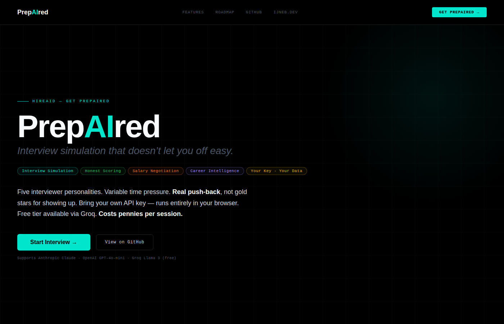
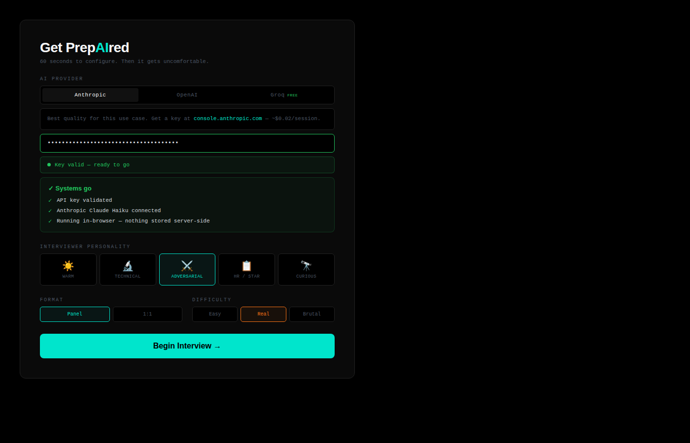
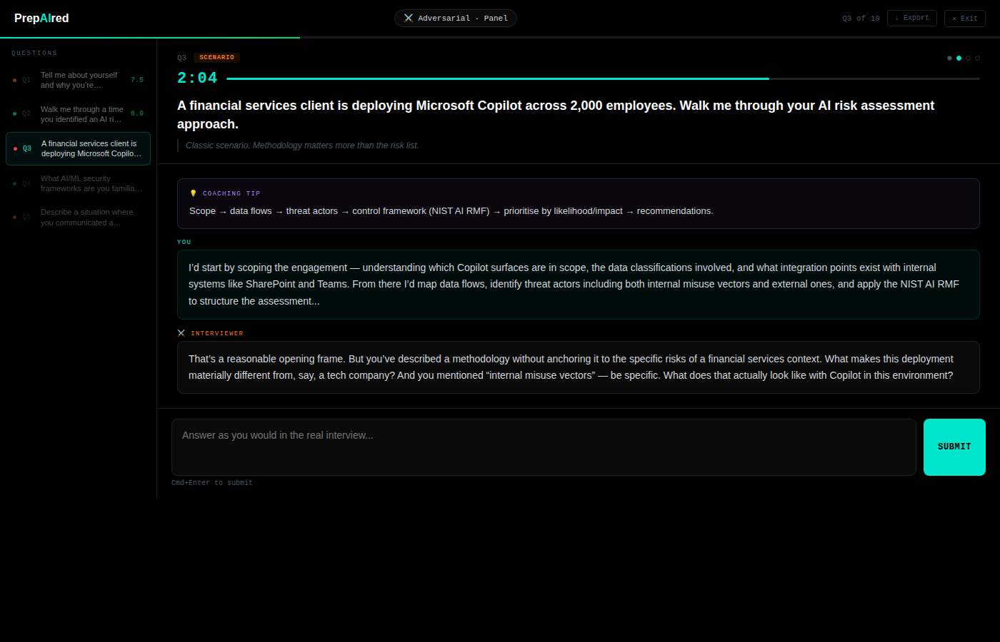
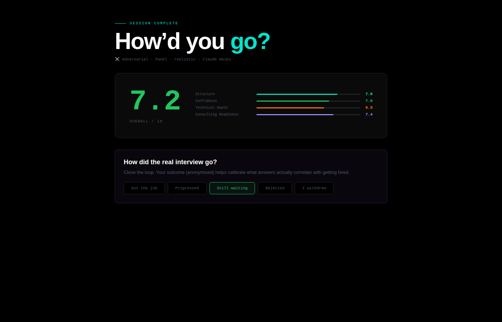

# 🎯 PrepAIred

> **Interview simulation that doesn't let you off easy.**

[](https://ijnebzor.github.io/prepaired)
[](CHANGELOG.md)
[](LICENSE)
[](#-security)
[](#-providers)

> Five personalities. Real time pressure. Honest scoring. Bring your own API key — runs entirely in your browser.

*Not a practice tool that tells you you're doing great. A simulation that tells you when you're not.*

---

## 📸 Screenshots

### Landing


### Setup — live key validation + Systems Go


### Interview in progress


### Session summary


---

## 🧠 What It Is

PrepAIred simulates a real interview — with an interviewer who pushes back, scoring calibrated to be honest, and time pressure that means something.

It is a **single HTML file**. No server. No account. No data leaving your machine except the API calls you explicitly make to your chosen provider.

**🔗 [Try it now →](https://ijnebzor.github.io/prepaired)**

---

## 🚀 Getting Started

1. Go to **[ijnebzor.github.io/prepaired](https://ijnebzor.github.io/prepaired)**
2. Click **Get PrepAIred →**
3. Choose your provider — Anthropic, OpenAI, or Groq *(Groq is free, no credit card)*
4. Paste your API key — it validates live against the provider before you can start
5. Watch the **Systems Go** panel confirm everything is ready
6. Optionally paste your bio or resume for personalised coaching
7. Pick personality, format, difficulty — begin

```bash
# Or run locally (API calls blocked from file://, use a server)
git clone https://github.com/ijnebzor/prepaired.git
cd prepaired
python3 -m http.server 8080
# open http://localhost:8080
```

---

## 🔑 Providers

| Provider | Model | Cost | Notes |
|---|---|---|---|
| **Anthropic** | Claude Haiku | ~$0.02/session | Best quality for this use case |
| **OpenAI** | GPT-4o-mini | ~$0.03/session | Solid alternative |
| **Groq** | Llama 3.1 8B | **Free** | No credit card. Ludicrous speed. |

Keys are validated live before the interview starts, stored in-memory only, and wiped on page unload.

---

## 🎭 Interviewer Personalities

| | Personality | Behaviour |
|---|---|---|
| ☀️ | **Warm** | Encouraging, constructive. Still probes gaps — just gently. |
| 🔬 | **Technical** | Rigorous. Demands specifics, frameworks, implementation detail. |
| ⚔️ | **Adversarial** | Tough and skeptical. Pushes back on almost everything. Not rude — relentless. |
| 📋 | **HR / STAR** | Wants Situation, Task, Action, Result. Redirects vague answers to real examples. |
| 🔭 | **Curious** | Intellectually engaged. Goes off-script when something interesting comes up. |

---

## ⏱️ Difficulty / Time Pressure

| Mode | Behavioural | Governance | Technical | Scenario |
|---|---|---|---|---|
| 🟢 Easy | 3:00 | 3:00 | 3:00 | 4:00 |
| 🟡 Real | 2:00 | 2:30 | 2:00 | 3:00 |
| 🔴 Brutal | 1:15 | 1:30 | 1:30 | 2:00 |

Timer auto-submits when it hits zero. The interviewer notes it.

---

## 📊 Scoring

Each answer is scored 1–10 across four dimensions:

| Dimension | What it measures |
|---|---|
| **Structure** | Logical flow, clarity, framing |
| **Confidence** | Conviction, directness, not hedging unnecessarily |
| **Technical Depth** | Specificity, correct terminology, real-world application |
| **Consulting Readiness** | Client orientation, stakeholder awareness, delivery thinking |

**Calibration:** 7 = solid. 9 = exceptional. 10 = almost never. Not inflated.

Do-overs are available (max 3 per question) but carry a **−0.5 overall penalty** per attempt.

---

## ✨ Features

- **🔑 Live API key validation** — Systems Go panel; Begin button locked until your key passes a live check
- **👤 Candidate profile** — paste your bio, resume, or LinkedIn URL for personalised coaching
- **💾 Session export** — full session as JSON: questions, scores, verdicts, attempt counts, transcripts
- **🔁 Feedback loop** — record the real interview outcome; anonymised locally for Phase 4 calibration
- **↺ Do-overs** — up to 3 per question with a score penalty; for genuine blanks, not comfort redos

---

## 🔒 Security

PrepAIred is built around one principle: **your key never leaves your hands.**

- API calls go directly from your browser to your chosen provider — no proxy, no backend
- Key stored in JS memory only; wiped on `beforeunload`
- `connect-src` CSP restricts outbound to Anthropic, OpenAI, Groq, and Google Fonts only
- No analytics. No telemetry. No third-party scripts.
- No cookies. localStorage stores only anonymised outcome data (capped at 50 entries).
- All user input sanitised before API submission

**Known limitations:**
- Key readable in browser devtools memory during the session
- AI responses rendered via `.innerHTML` — a compromised provider endpoint could inject content (mitigated by `connect-src` CSP)

Full threat model, controls, and responsible disclosure: **[SECURITY.md](SECURITY.md)**

---

## 🗺️ Roadmap

| Phase | Status | What |
|---|---|---|
| **1.0** | ✅ Done | Interview simulator — 5 personalities, timer, honest scoring |
| **1.5** | ✅ Done | Multi-provider, candidate profile, session export, feedback loop, live key validation |
| **2.0** | 🔜 Next | JD ingestion — paste a job URL or PDF; AI generates role-specific questions with salary benchmarks |
| **3.0** | 📋 Planned | Salary negotiation simulator — offer roleplay, counter coaching, market bounds |
| **4.0** | 🧠 Planned | Career intelligence — gap analysis, pathway planning, outcome calibration |

Full detail: **[phases/ROADMAP.md](phases/ROADMAP.md)**

---

## 🏗️ Tech

Single HTML file. No build process. No dependencies. No framework.

| Thing | Choice |
|---|---|
| Language | Vanilla JS (ES2020) |
| Styling | CSS custom properties, no preprocessor |
| Fonts | Syne + JetBrains Mono via Google Fonts — degrades gracefully if blocked |
| Providers | Anthropic Messages API · OpenAI Chat Completions · Groq (OpenAI-compatible) |
| Screenshots | Playwright (dev only, not shipped) |

---

## 📜 License

MIT. See [SECURITY.md](SECURITY.md) for responsible disclosure.

---

*Built by [Benji Zorella](https://ijneb.dev) · AI-assisted · Brought to life with 🧠 and ❤️ by Claude*

---

*"Gold stars are for kindergarten."*
